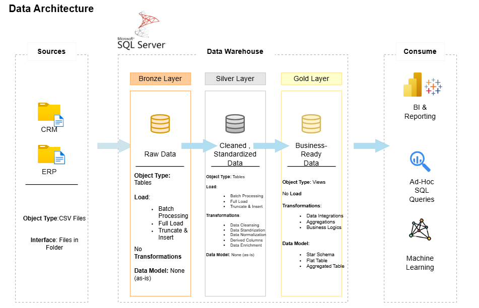

# Data Warehouse Project

  The purpose of this project is to build a business-ready data warehouse from source systems through an ETL process, optimized for analytics and reporting. The end goal is to present a clean, transformed dataset structured around clear business objects such as Customers, Products, and Sales — enabling analysts and stakeholders to derive reliable insights. 

This project involves:
**Data Architecture:** Designing a Modern Data Warehouse using Medallion Architecture  (Bronze, Silver and Gold).
**ETL Pipelines:** Extracting, transforming, and loading data from source systems into the warehouse
**Data Modeling:** Developing fact and dimension tables optimized for analytical queries.


## Project Requirements

**Building the Data Warehouse**

  Develop a modern data warehouse using SQL Server to consolidate sales data, enabling analytical and insightful decision making.

**Specifications:**
**Data Sources:** Import data from two source systems (ERP and CRM) provided as CSV files.
**Data Quality:** Cleanse and resolve data quality issues prior to integration 
**Data Integration:** Combine the two source systems into a single user-friendly data model
**Scope:** Focus on the latest dataset only; historization of data is not required.


## Data Architecture

The data architecture for this project follows Medallion Architecture Bronze, Silver and Gold Layer.



**1. Bronze Layer:** Stores raw data from source systems. Data from the csv files is ingested into SQL Server Database.

**2. Silver Layer:** This layer includes data cleansing, standardization and normalization processes to prepare data for analytics.

**3. Gold Layer:** This layer stores the business ready data modeled into a star schema required for reporting and deriving insights.

## Repository Structure
```
sql-data-warehouse-project.git/
├── LICENSE
├── README.md
├── datasets/
│   ├── source_crm/
│   │   ├── cust_info.csv
│   │   ├── prd_info.csv
│   │   └── sales_details.csv
│   └── source_erp/
│       ├── CUST_AZ12.csv
│       ├── LOC_A101.csv
│       └── PX_CAT_G1V2.csv
├── docs/
│   ├── data_ architecture.drawio
│   ├── data_architecture.png
│   ├── data_flow.drawio
│   ├── data_flow.png
│   ├── data_integration.drawio
│   ├── data_integration.png
│   ├── data_model.drawio
│   ├── data_model.png
│   └── naming_conventions.md
├── scripts/
│   ├── bronze/
│   │   ├── ddl_bronze.SQL
│   │   └── proc_load_bronze.SQL
│   ├── data_preparation_steps_gold_layer.txt
│   ├── gold/
│   │   └── ddl_gold.SQL
│   ├── init_database.sql
│   └── silver/
│       ├── ddl_silver.SQL
│       └── proc_load_silver.SQL
└── tests/
    ├── quality_checks_gold.SQL
    └── quality_checks_silver.SQL

```
## End Product

- **Schema Type**: Star Schema
- **Fact Table**: `fact_sales`
- **Dimension Tables**: `dim_customers`, `dim_products`
- **Relationship**: 1 (mandatory) — to — many (optional)
  - 1 `dim_customers` → many `fact_sales`
  - 1 `dim_products` → many `fact_sales`

## Naming Conventions

See the full [Naming Conventions](docs/naming_conventions.md) document for detailed rules and examples.

## Key Takeaways

As someone transitioning into data analytics, I built this end-to-end data warehouse project to understand the lifecycle of data — from loading raw data, to cleaning and transforming it, to applying business logic, and finally presenting it as a dataset optimized for deriving insights. 

This project helped me understand the importance of handling missing and invalid values, resolving inconsistent data across source systems,maintaining readable commenting, managing relationships between tables, and designing the end solution to be analyst and business-friendly.

I also understood the importance of communication between data analysts/engineers and source system experts. Decisions like choosing a "master" source for conflicting data (e.g., CRM vs ERP) should be made with input from the teams who own and understand that source system — this project helped me recognize when to clarify data inconsistencies with relevant stakeholders rather than making assumptions on my own.


## Contact

**Vaidhehi Pradhanah**
Aspiring Data Analyst | SQL | [LinkedIn](https://www.linkedin.com/in/vaidhehi-pradhanah/ )

